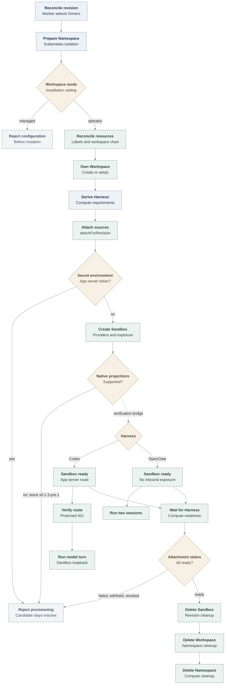

# OpenShell Sandbox provisioning flow

## Overview

The Kubernetes Compute Driver delegates dedicated Codex and native OpenClaw
Harnesses to the selected OpenShell Sandbox Driver. One deployment-paired OpenShell Gateway uses
an explicitly configured workspace mode. Operator mode is implemented: for each
OCC Namespace, the Driver labels the Kubernetes namespace, reconciles rendered
workspace-chart resources, and creates or adopts an OpenShell Workspace with
the same physical name. Managed mode is recognized but fails before mutation.
Sandbox requests are homed in the operator-mode Workspace.

The model credential no longer needs a Secret projection: a
[credential source](credential-source-lifecycle.md) attaches an OpenShell
provider to the Sandbox, and the supervisor proxy injects the key. The regular
Agent workflow with stock OpenShell still stops before Sandbox creation because
`v0.1.3-pre.1` cannot accept the Secret-backed app-server token or projected workload
identity. The verification-only compatibility path stages those inputs without
changing the production fail-closed contract and completes real model turns
inside the Sandbox.

The local Kubernetes development profile installs the pinned Gateway and
renders the workspace chart into the Installation configuration, in either a
Kubernetes-only or Compose control plane. Neither uses the verification-only
compatibility projection.

## Entry Points

- Trigger: a worker reconciles an Agent revision that selects the OpenShell
  Sandbox Driver and Kubernetes Compute Driver.
- Source: `apps/controller/src/drivers/sandbox/openshell.ts:ensureNamespace`
- Source: `apps/controller/src/drivers/sandbox/openshell.ts:provisionHarness`
- Source: `apps/controller/src/drivers/compute/kubernetes/index.ts:prepareRevision`
- Assumptions: the Installation selected Kubernetes Compute, the OpenShell
  Sandbox, and the OpenShell Credential Gateway through one `openshell` Backend;
  the tenant Namespace and baseline isolation exist; and the Gateway is ready in
  operator workspace mode.

## Flow

## Execution Trace

### 0. Create the development control plane

`scripts/dev-up`, `internal/occdev/openshell_k3d.go:upK3d`,
`internal/occdev/openshell.go:prepareOpenShell`,
`internal/occdev/kubernetes.go:writeInstallation`

The written Installation declares the `openshell` Backend with the Gateway
endpoint, the Sandbox, and a Credential Gateway whose `binaries` list holds the
native Codex executable. The Sandbox policy has no model-egress rule; the
credential source's provider profile supplies it.

The environment selects Kubernetes Compute and OpenShell. `scripts/dev-up`
validates that combination and delegates lifecycle ownership to `occ dev up`.
The control plane defaults to Compose; `OCC_DEVELOPMENT_CONTROL_PLANE=kubernetes`
selects the Kubernetes-only profile. Both verify the `v0.1.3-pre.1` source archive
before packaging its Gateway and Workspace charts, and import the matching
digest-pinned Gateway, Sandbox, and supervisor images. The launcher supplies v0.1.3-pre.1's separate
image registry, repository, and digest values for each component and omits the
NetworkPolicy acknowledgement removed from that chart.
The CLI records the exact engine endpoint, cluster,
platform Namespace, API port, and key destination before creating resources.
The Kubernetes-only mode creates k3d without a Compose network, imports the OCE controller, Agent
runtime, PostgreSQL, and three OpenShell images, and resolves their in-cluster
digests. Unless the developer selects existing images explicitly, startup
rebuilds the controller and Agent runtime from the current checkout before
importing them.

`installKubernetesControlPlane` creates protected PostgreSQL and bootstrap PVCs,
runs migration and bootstrap through the production OCE Helm chart, and deploys
the API and worker in `oce-system`. The Installation selects in-cluster
Kubernetes authentication and the central Gateway's ClusterIP DNS name. A
labeled development proxy is the API NetworkPolicy's only local client; k3d
publishes its NodePort on host loopback. A separate development NetworkPolicy
admits the OCE API, which registers providers, and the worker to the Gateway. The Gateway ingress policy also admits
OpenShell supervisor Pods, but only from OCE-owned tenant namespaces. In each
tenant namespace, the callback egress policy selects only Pods carrying the
OpenShell managed-by and supervisor boundary labels. Other tenant Pods cannot
reach the Gateway even though this disposable profile enables OpenShell's
unauthenticated development mode. Because the cluster is disposable, the helper
also binds the Helm chart's tenant roles to the OCE service accounts for all
Namespaces. A development ClusterRole lets the worker manage the workspace Role
and RoleBinding, with `bind` and `escalate` limited to the pinned OpenShell
workspace Role. Production retains operator-owned tenant-local RoleBindings.
Startup copies the generated service key
through a temporary PVC reader Pod, verifies it against the live Installation,
and removes the reader.

Cleanup validates the private state and recorded engine endpoint before deleting
the named cluster. The Kubernetes-only state contains no Compose snapshot, and
the cleanup path never calls a Compose provider.

In Compose mode, `internal/occdev/up.go:Up` starts PostgreSQL, migration, and
bootstrap before creating k3d on the private Compose network. It installs the
Gateway in `openshell-system` with a fixed NodePort, writes kubeconfig-based
Driver configuration, and starts the API and Kubernetes worker in Compose. The
worker reaches the Gateway through the owned container network. Cleanup stops
the reconcilers, deletes the cluster, removes the recorded Compose project and
volumes, and retains recovery state if any step fails.

### 1. Prepare the Namespace and OpenShell Workspace

`apps/controller/src/drivers/compute/kubernetes/index.ts:ensureNamespace`

Kubernetes Compute reconciles quota, limits, and baseline NetworkPolicies before
calling `SandboxDriver.ensureNamespace`. The Driver first checks
`gateway.workspaceMode`. Managed mode returns an unsupported-mode error before
using the Kubernetes client or Gateway. Operator mode applies the configured
namespace label, workspace-chart resources, and provider NetworkPolicies, in
that order, then calls the Gateway health RPC. If configured, namespace-local
readiness observations happen before that health check; the development
operator instead supplies the central Gateway endpoint directly.

The Driver derives the Workspace name from Compute's physical Kubernetes
namespace name. It reads the Workspace, creates it when missing, or rereads it
after a concurrent `ALREADY_EXISTS`. Adoption requires the expected name, OCC
Namespace ID label, managed-by label, and active phase. Any conflict fails the
Namespace operation. Kubernetes Compute uses `oce-` plus a 15-character digest
so the same name satisfies OpenShell v0.1.3-pre.1's 19-character limit.

### 2. Derive the provider-owned Harness request

`apps/controller/src/drivers/compute/kubernetes/index.ts:prepareRevision`

For a dedicated revision with `provisionHarness`, Compute derives Harness image,
command, labels, environment, workspace mounts, ServiceAccount identity, and
resources from the same Deployment shape used by the regular Kubernetes path.
For a `credential_source` revision it renders only `CODEX_LOGIN_MODE=api_key`,
no model Secret, and calls `CredentialGatewayDriver.attachForRevision`. The
attachments, one provider name per source, go into
`requirements.credentialAttachments`. Compute passes those requirements and the
immutable revision to OpenShell instead of creating the Deployment itself.

### 3. Validate and serialize the Sandbox

`apps/controller/src/drivers/sandbox/openshell.ts:provisionHarness`

OpenShell accepts only dedicated Codex or OpenClaw revisions pinned to the selected Driver.
It builds filesystem, process, and network policy plus Kubernetes driver config.
Network TLS, enforcement, and access spellings must be own keys in the Driver's
allowlists before they are converted to the exact `v0.1.3-pre.1` protobuf enums.
It rejects inherited object names and the old `passthrough` TLS spelling,
which v0.1.3-pre.1 defines as an automatic inspection alias; use `skip` instead. Each network policy also requires at
least one executable path and sends those binary identities with its endpoints.

The regular Harness requirements still contain the Secret-backed
`APP_SERVER_TOKEN`. Without the explicit test-cluster bridge, `environment`
rejects it before any gateway mutation, so the candidate revision remains
inactive. With the bridge selected, `provisionHarness` calls
`apps/controller/src/drivers/sandbox/openshell-compatibility.ts:prepareOpenShellCompatibility`.
That function requires the configured gateway sandbox ServiceAccount to equal
Compute's Agent ServiceAccount, runs an Agent-owned bootstrap Job, and waits for
its success. The Job copies the two Secret values, immutable plugin-runtime
files, and an audience-bound ServiceAccount token to revision-scoped PVC paths.
The Driver substitutes read-only PVC mounts and a command bootstrap for the
unsupported Secret and projected-volume shapes, then asks OpenShell to create
the Sandbox. A bootstrap or create failure starts a cleanup Job; revision
retirement deletes the Sandbox before removing the copied credentials. The
cleanup Job reuses the bootstrap Pod template but removes the old Job's
Kubernetes-assigned selector labels so the new Job can receive its own. A
cleanup failure leaves replacement preparation pending. The copied token is
not refreshed during a running revision.
`sandboxProviders` appends each attachment to the static `providers` list and
rejects a name outside the OCC `oce-cs-` shape or one that repeats a static
provider. The development profile and real-runtime fixture bind the provider
profile to the exact native Codex executable in the runtime image's pnpm tree.
A dependency-layout change must update that path; a stale one fails the Codex
startup model probe.

The verification-only v0.1.3-pre.1 Gateway permits caller driver configuration and
disables OpenShell resource admission so the compatibility request can attach
OCE-owned PVCs without OpenShell approval labels. The Enterprise Driver still
limits the request to the Harness mounts approved by Kubernetes Compute. The
stock fail-closed path never reaches this Gateway setting, and production does
not use this compatibility configuration.

Native OpenClaw trusts OpenShell's interception CA and the Gateway
enrollment CA.

### 4. Call the versioned gateway contract

`apps/controller/src/drivers/sandbox/openshell-gateway-client.ts:createSandbox`

The client sends the Sandbox identity, spec, Namespace Workspace scope, and
revision UUID as `request_id`. Codex requests one unnamed exposure for
`APP_SERVER_PORT` and requires its `service_urls` entry. The explicit
test-cluster bridge selects bearer passthrough for that exposure; omission
keeps upstream's authorization-strip default. Native OpenClaw connects
outbound, so it requests no exposure and rejects any returned URL. A replay
returns the same result; a Sandbox that predates replayable creation fails.

For each unary Gateway call, the client checks cancellation after client setup
and credential-metadata preparation and before dispatch. An abort during setup
is observed when the pending setup step settles; it does not bound a stalled
initialization or file read. Once dispatched, an abort requests cancellation
of the local gRPC call and rejects the caller. That request does not prove a
remote mutation stopped; the calling lifecycle must handle any uncertain
effect through its existing recovery and cleanup path.

Stock `v0.1.3-pre.1` still lacks the exact projected identity and volume support
required by the request, including the immutable plugin-runtime ConfigMap
mounted by Kubernetes Compute. Any request that reaches
the gateway without those shapes still fails closed. Any other gateway failure
also prevents readiness.

For private node routing, OpenShell's policy proxy opens the connection from its
supervisor Pod rather than the Harness Pod. The Helm-owned Envoy NetworkPolicy
therefore admits supervisor Pods only from tenant namespaces bearing the exact
Gateway attachment label. OpenShell still restricts the destination and calling
binary through the Sandbox network policy.

### 5. Observe readiness or clean up

`apps/controller/src/drivers/compute/kubernetes/index.ts:prepareRevision`

After a successful create, Compute verifies that the returned reference belongs
to the revision and waits for the provider-owned Harness Pod. For bound
sources it then calls `attachmentStatus`, which reads
`GetSandboxProviderStatus`. `pending` or a missing status retries; `failed`,
`withheld`, `revoked`, or `absent` fails the revision; only `ready` for every
attachment completes preparation. On revision
shutdown, `shutdownRevisionRuntime` calls `cleanup` with the revision. The
Gateway client sends `DeleteSandbox` with the same `workspace_scope`; a missing
Sandbox is an idempotent success.

The current unified `cleanup` contract receives the immutable revision during
revision shutdown and no revision during Namespace deletion. Namespace deletion
runs it after revision resources are gone. OpenShell verifies exact Workspace
ownership, sends idempotent
`DeleteWorkspace`, and then removes configured workspace-chart resources and
NetworkPolicies in reverse order. A terminating Workspace remains eligible for
retry after a lost response. Only after Sandbox cleanup succeeds does
Kubernetes Compute delete the Kubernetes namespace.

## Debugging and Verification

- `OCC_DEVELOPMENT_COMPUTE_DRIVER=kubernetes OCC_DEVELOPMENT_CONTROL_PLANE=kubernetes OCC_DEVELOPMENT_SANDBOX_DRIVER=openshell ./scripts/dev-up`
  creates the reusable Kubernetes-only development environment: PostgreSQL, the
  Helm-installed OCE control plane, and the central Gateway share `oce-system`;
  tenant resources remain in OCC-owned Namespaces. `scripts/dev-down` removes
  only the recorded cluster and private state.
- Use the default `OCC_DEVELOPMENT_CONTROL_PLANE=compose` to keep PostgreSQL
  and OCC in Compose while retaining the same k3d Compute, operator Workspace,
  and fail-closed Agent boundaries.
- `node --test tests/integration/ci-openshell.test.mjs` checks bootstrap safety
  and immutable Helm image value rendering without selecting a real cluster.
- `node --test tests/integration/sandbox-driver-startup.test.mjs` checks Driver
  selection, Workspace ownership, idempotence, and fail-closed configuration.
- `OCC_TEST_DEV_UP_OPENSHELL_REAL=1 node --test tests/integration/dev-up-openshell-k3d-real.test.mjs`
  installs the deployment Gateway, renders the workspace chart, lets the Driver
  apply its resources to bootstrap and post-start Namespaces in a disposable k3d
  cluster, and reads both real OCC-owned Workspaces through the Gateway API.
- `OCC_TEST_DEV_UP_OPENSHELL_COMPOSE_REAL=1 node --test tests/integration/dev-up-openshell-k3d-real.test.mjs`
  runs the Compose control-plane profile against a disposable real k3d cluster,
  reads its operator-mode Workspace through the Gateway API, and exercises
  recorded Compose and cluster cleanup.
- `OCC_TEST_OPENSHELL_K3D_REAL=1 node --env-file="$TEST_ENV_FILE" --test tests/integration/sandbox-driver-openshell-k3d-real.test.mjs`
  exercises the selected real gateway and cluster prerequisites. Set
  `OCC_TEST_OPENSHELL_SECRET_PROJECTION=0` for stock `v0.1.3-pre.1`; the expected
  result is `APP_SERVER_TOKEN` projection rejection before activation, which
  does not prove a model turn. Both modes register an `openai` credential source
  through the API. Mode `1` selects a verification-only compatibility path: an
  operator Job stages the app-server token, plugin-runtime files, and projected
  workload token in revision-specific PVC subpaths, never the model key. The
  test asserts that Harness processes hold only the OpenShell placeholder. The provider-owned
  Sandbox exposes its app-server port at create time. The test observes the
  protected app server's authentication rejection when the test-cluster bridge is unset and OpenShell defaults to `STRIP`,
  then runs the real model and tool checks from inside the Pod. This mode proves
  v0.1.3-pre.1 containment, the Compute-created node route, Helm NetworkPolicy
  enforcement, exposed-route reachability, and lifecycle behavior. It does not
  prove native workload projection or an authenticated model turn through the
  exposed route. The tested runtime uses the OpenClaw source commit pinned by
  `deploy/runtime/Dockerfile`; that source provides the native worker's
  `connect --ephemeral` path and the workspace-node
  `--pair-if-needed` and `--commands` options required by the test.
- `OpenShell v0.1.3-pre.1 cannot receive secretKeyRef environment APP_SERVER_TOKEN ...`
  identifies the current fail-closed boundary.
- `OCC_TEST_OPENSHELL_HARNESS=openclaw` runs two native sessions over one
  outbound connection with no inbound Harness service.

## Related docs

- [OpenShell Sandbox Driver](../reference/drivers/openshell-sandbox.md) and [OpenShell Credential Gateway](../reference/drivers/openshell-credential-gateway.md)
- [Credential source lifecycle](credential-source-lifecycle.md)
- [OpenShell tests](../testing/openshell.md)
- [Kubernetes Compute Driver](../reference/drivers/kubernetes-compute.md)
- [Harness execution topology](harness-execution-topology.md)

## Manual Notes

[keep this for the user to add notes. do not change between edits]

## Changelog

- 2026-10-01 17:18: Documented bridge cleanup Job selector handling during revision replacement. (authoring-run/7769dc65-9827-4c91-a013-90a7ce60ffa1 - 7e872afc8e9e043308ef0a58f83408d9db34e105)

- 2026-09-30 21:14: Updated the OpenShell source, images, charts, and wire fixture to v0.1.3-pre.1 while preserving the default service authorization and fail-closed projection boundaries. (authoring-run/b158c89c-3010-42ae-95b4-350b05de7441 - 37bbee705ea3808ad000413dd54bdcc718980179)

- 2026-09-30 09:49: Documented Gateway call cancellation and uncertain remote effects. (authoring-run/f1c1bde3-0893-42d4-89ed-3251c885a893 - 90899dc55ab79d0244533b7dcde657fecf35bb08)

- 2026-09-28 02:55: Added outbound-only native OpenClaw with broker CA trust. (oce-pr-440-sync - e2b739f51f89)

- 2026-09-28 00:34: Restored Compose defaults and explicit Kubernetes-only startup. (01a0e441-02f9-70b2-ad45-0a1a5049954a - 201f31d511464133f06e0526bb5545ed1cb27e25)

- 2026-09-26 14:29: Documented the shared `openshell` Backend, credential-source attachments in Sandbox creation, attachment readiness before activation, and the app-server token as the first remaining stock blocker. (claude-code/session_014fi7Uq1LyofgqwLrLoQ3yY - 849b2b24111fe237b12da5be1d4b411d3146cefb)

[OpenShell Sandbox provisioning documentation history](openshell-sandbox-provisioning/history.md) preserves the older dated entries.
